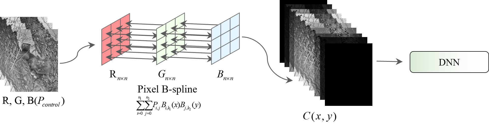
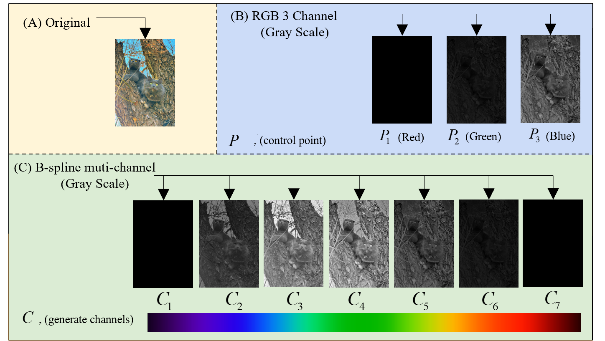
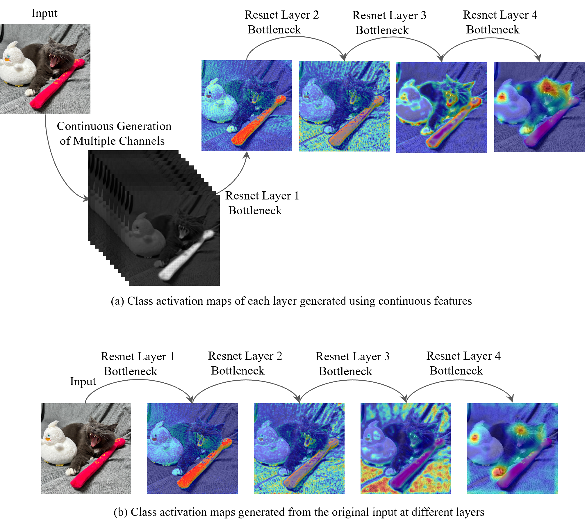

# Continuous Feature Generation via B-Spline Channel Expansion

This repository implements the core experimental code of the paper *Convolutional Neural Networks Based on Continuous Feature Generation*. The method treats the RGB three-channel image as **B-spline control points** along the channel dimension, constructs a continuous function via the de Boor–Cox recursion, and resamples it along the channel dimension to generate multi-channel continuous features (3 → 6/9/12/15/18 channels), which are then fed to a CNN for classification.

> **Entry point**: training/testing always starts from the top-level `main2.py`. Visualization scripts live in `scripts/` and automatically prepend the parent directory to `sys.path`, so they can be run directly as `python scripts/cam.py` etc.

---

## Core Method

The three functions in `torchvision_local/inter_models/resnet.py` implement the core method:

| Function | Purpose |
|---|---|
| `b_spline_basis(u, knots, k, i)` | de Boor–Cox recursion for the i-th order-k B-spline basis |
| `b_spline_feature(control_points, num_points, k)` | Treat channels as control points, uniformly sample `num_points` points in `[0,1]` to generate B-spline curve channels |
| `ResNet._forward_impl` | If `method=="b_spline"` and `num_points>0`, concatenate generated channels: `x = cat([x, spline_feature], dim=1)`; the first conv input becomes `3 + num_points` |

> **Parameter mapping**
> - `num_points` = number of *extra generated* channels (paper table columns 3/6/9/12/15/18)
> - `k` = B-spline order (paper uses `k=3`, i.e. quadratic spline)

---

## Requirements

### Hardware
- 8× NVIDIA GPU recommended (experiments used 8× A100-16GB / V100)
- Single GPU also works (`--gpu 0` or `--cuda_id 0`)

### Software
- Python ≥ 3.8
- PyTorch ≥ 1.12 (needs `torch.linspace` device arg, `torch.where`)
- torchvision (this project uses the bundled `torchvision_local`)

### Python Dependencies
```bash
pip install torch torchvision
pip install numpy matplotlib scipy scikit-learn seaborn tqdm opencv-python
pip install mlflow tensorboard
pip install pytorch-grad-cam
```

Or install from `requirements.txt`:

```
torch>=1.12.0
torchvision>=0.13.0
numpy
matplotlib
scipy
scikit-learn
seaborn
tqdm
opencv-python
mlflow
tensorboard
pytorch-grad-cam
```

---

## Dataset Preparation

### ImageNet
Standard layout:
```
/path/to/imagenet/
├── train/   # 1000-class subfolders
└── val/     # 1000-class subfolders
```

### CIFAR-10
`main2.py` uses `datasets.CIFAR10(..., download=True)`; pass `--dataset cifar10` and it will auto-download if the directory is absent.

---

## Training

### ImageNet Training

```bash
python main2.py /path/to/imagenet \
    --arch resnet18 \
    --dataset imagenet \
    --num_points 3 \
    --k 3 \
    --epochs 90 \
    -b 256 \
    --lr 0.1 \
    --cuda_id "0,1,2,3,4,5,6,7" \
    --method b_spline \
    --track_url http://127.0.0.1:5000
```

### CIFAR-10 Training

```bash
python main2.py /path/to/cifar \
    --arch resnet34 \
    --dataset cifar10 \
    --num_points 12 \
    --k 3 \
    --epochs 90 \
    -b 256 \
    --cuda_id "0,1,2,3" \
    --method b_spline \
    --track_url http://127.0.0.1:5000
```

### Distributed Training (Multi-Node)

```bash
python main2.py /path/to/imagenet --multiprocessing-distributed \
    --rank 0 --dist-url tcp://127.0.0.1:23456 --world-size 1 \
    -a resnet50 --num_points 12 --k 3 -b 256 -j 4
```

### Main Command-Line Arguments

| Argument | Description | Default |
|---|---|---|
| `data` (positional) | dataset path | `imagenet` |
| `num_points` (positional) | generated channel count | `0` |
| `k` (positional) | B-spline order | `2` |
| `-a / --arch` | model arch (resnet18/34/50/101/152...) | `resnet18` |
| `--dataset` | `imagenet` or `cifar10` | — |
| `--epochs` | number of epochs | `90` |
| `-b / --batch-size` | total batch size across GPUs | `256` |
| `--lr` | initial learning rate | `0.1` |
| `--method` | `b_spline` or SOTA method name (mst etc.) | `b_spline` |
| `--cuda_id` | GPU ids (comma-separated) | `None` |
| `--pretrained_model_path` | pretrained weight path | `None` |
| `--track_url` | MLflow server URL | — |
| `--resume` | checkpoint path | `''` |
| `--evaluate` | evaluation-only mode | `False` |

### Comparing with SOTA Multi-Channel Generation Methods

`--method` supports `b_spline` and SOTA methods (MST/MST++/Restormer/MPRNet/HSCNN+/AWAN/HRNet/HDNet/EDSR/MIRNet). In SOTA mode, `inter_model` is loaded by `architecture.model_generator` and **frozen** (`requires_grad=False`); the forward pass first generates multi-channel features from RGB via `inter_model`, then concatenates them with RGB before feeding the classifier. In `b_spline` mode, `inter_model` is `None` and channels are generated inside `ResNet._forward_impl` via `b_spline_feature`. SOTA comparison example (requires a pretrained weight):

```bash
python main2.py /path/to/imagenet -a resnet18 --method mst \
    --num_points 31 --k 3 --pretrained_model_path model_zoo/mst.pth \
    --track_url http://127.0.0.1:5000
```

> Note: this mode does **not** require `--pretrained` (that only loads a pretrained classifier); the generator weights come from `--pretrained_model_path`.

---

## Testing / Evaluation

```bash
# Evaluate on the validation set (requires an existing checkpoint)
python main2.py /path/to/imagenet -a resnet18 --num_points 3 --k 3 \
    --resume checkpoint.pth.tar --evaluate \
    --cuda_id "0" --dataset imagenet --method b_spline
```

During training, `checkpoint.pth.tar` and `model_best.pth.tar` (best model) are produced in the current directory, and `Train/Test Accuracy 1/5` and `Train/Test loss` are logged to MLflow.

---

## Visualization Tools

> All visualization scripts are under `scripts/` and already add the parent dir to `sys.path`; run them from the project root.

### 1. CAM Visualization

```bash
python scripts/cam.py --image-path cat_test.jpg \
    --model model/resnet34_3_imagenet.pth \
    --channel 3 --method gradcam --output-dir ./out
```

Supports GradCAM / GradCAM++ / ScoreCAM / LayerCAM and a dozen other methods, outputting per-layer results for `layer1-layer4`.

### 2. t-SNE Feature Distribution

Configure model paths and dataset in `visualize_feature_comparison` inside `scripts/draw_tsne.py`:

```python
config = {
    'dataset_name': 'cifar10',
    'data_dir': '/path/to/cifar',
    'rgb_model_path': 'model/resnet34_0_cifar.pth',
    'continuous_model_path': 'model/resnet34_12_cifar.pth',
    'rgb_num_classes': 10,
    'cont_num_classes': 10,
    'num_samples': 2000,
    'batch_size': 64,
    'perplexity': 30,
    'n_iter': 1000,
}
```

Run:
```bash
python scripts/draw_tsne.py
```

### 3. Generated-Channel Correlation Analysis

```bash
python scripts/feature_correlation_coefficient.py
```

Outputs a correlation heatmap between generated and original channels to assess information redundancy.

### 4. Font Check

```bash
python scripts/test_font.py
```

Checks whether matplotlib has Times New Roman installed, for journal-compliant figures.

---

## Paper Figures

`figures/` contains three paper figure assets:

| File | Content |
|---|---|
| `figures/model.png` | Overall method framework |
| `figures/image1.png` | RGB vs multi-channel comparison |
| `figures/cam.png` | CAM comparison |







---

## FAQ

**Q1: `torchvision_local` conflicts with system torchvision?**
- `main2.py` adds the parent dir to `sys.path` to import `torchvision_local`. Ensure you run from the `continues/` parent directory, or confirm `import torchvision_local` points to this folder.

**Q2: B-spline order k vs paper?**
- The paper uses `k=3` (quadratic spline). `k=2` also runs but has C⁰ smoothness.

**Q3: MLflow not started?**
- Training depends on MLflow for metric logging. Comment out `mlflow.start_run`-related code in `main2.py` if not needed, or start a local MLflow server:
  ```bash
  mlflow server --host 127.0.0.1 --port 5000
  ```

**Q4: num_points vs total input channels?**
- Total input channels = 3 (RGB) + `num_points` (generated). The paper table columns equal `num_points`.

---

## License

For academic research use only.
